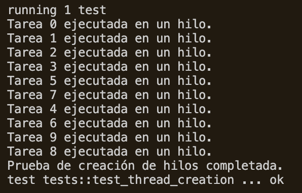
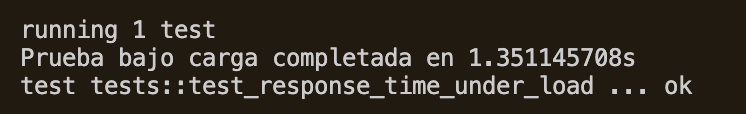
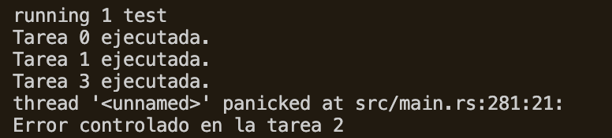

# rust-http

# Instituto Tecnológico de Costa Rica
## Escuela de Ingeniería en Computación
### Implementación de Servidor HTTP

- Greivin Mauricio Fernández Brizuela c.2022437510
- Daniel Alonso Garbanzo Carvajal c.2022117129
- Ericka Michelle Cerdas Mejias c.2022138199

**IC-6600 - Principios de Sistemas Operativos**
* Fecha de entrega: 4 de octubre

## Descripción del Proyecto

Este proyecto implementa un servidor HTTP simple desde cero utilizando Rust. El servidor soporta las principales operaciones HTTP (GET, POST, PUT, DELETE, PATCH) y gestiona sesiones de usuario con cookies. Está diseñado para manejar múltiples solicitudes concurrentes utilizando hilos y asegura el acceso seguro a los datos de sesión mediante `Arc` y `Mutex`.

## Requisitos para correr el proyecto

1. Rust instalado, en caso de no tener Rust se puede instalar siguiendo las instrucciones en este [enlace](https://doc.rust-lang.org/book/ch01-01-installation.html)
2. Una vez instalado, para correr los tests se corre el siguiente comando.
```bash
cargo test
```
3. Para levantar el servidor se corre el siguiente comando
```bash
# Dirigirse al folder del server
cd rust-http
# Levantar servidor
cargo run
```

## Descripción General de la Arquitectura

El servidor está estructurado en tres componentes principales:

**Server**: El `server` se encarga de manejar las cookies y mantiene la conexión abierta, puede procesar hasta 4 requests de manera simultánea al tener 4 hilos en un thread pool estático.\
**Client**: El `client` se encarga de manejar el request, esto incluye hacer el parsing del mismo y manejar el método del request de manera correcta.\
**Methods**: `methods` se encarga de manejar los diferentes métodos HTTP (GET, POST, PUT, DELETE, PATCH). La implementación de cada método se realizó para realizar las operaciones correspondientes a los archivos en la carpeta `rust-http/files`.

## Manejo de Concurrencia (hilos)

La concurrencia se logra utilizando las características de la biblioteca estándar de Rust:

- **Hilos**: Cada conexión entrante entra al threadpool estático, el cual tiene 4 hilos. Estos hilos se encargan de manejar el request de manera adecuada.
- **Datos Compartidos**: Se utiliza el patrón `Arc<Mutex<Server>>` para compartir de forma segura el acceso a los datos de sesión del servidor entre hilos. `Arc` permite múltiples propietarios, y `Mutex` asegura que solo un hilo pueda acceder o modificar los datos a la vez.

## Manejo de Cookies (sesiones)

El servidor maneja la gestión de sesiones utilizando cookies. Cuando un nuevo cliente se conecta, se genera un ID de sesión único utilizando la crate `uuid`, y se almacena en el `HashMap` de sesiones del servidor. Si una solicitud contiene una cookie de sesión, el servidor verifica las sesiones existentes y reutiliza la sesión si es válida.

## Manejo de errores

El servidor tiene manejo de errores para requests que están mal formados o les hacen falta datos para crear o modificar. Entre los errores se manejan los siguientes: `400: Bad Request`, `404: Not Found`, `500: Internal Server Error`. En caso de que haya un error al parsear el JSON se envía un status code `500` con su respectivo mensaje de error. Si hacen falta datos en el request o el request está mal formado se envía un status code `400` con su respectivo mensaje de error.

## Operaciones HTTP

El servidor soporta las siguientes operaciones HTTP:

- **GET**: Recupera recursos basados en la ruta solicitada.
- **POST**: Crea un archivo con los datos enviados en el cuerpo de la solicitud.
- **PUT**: Actualiza recursos con los datos proporcionados.
- **DELETE**: Elimina recursos especificados por la ruta.
- **PATCH**: Actualiza parcialmente recursos con los datos proporcionados.

<!-- ## 9. Pruebas del Fixed Thread Pool
- **Prueba de Creación de Hilos**:
      Objetivo:
      Verificar que el Fixed Thread Pool crea hilos solo hasta el límite establecido y reutiliza los hilos existentes para nuevas solicitudes.

      Procedimiento:
         1. Configura el pool con un tamaño fijo, por ejemplo, 4 hilos: let pool = ThreadPool::new(4);.
         2. Inicia el servidor.
         3. Envía múltiples solicitudes (más de 4) concurrentemente usando curl o una herramienta similar:
   
      Resultado Esperado:
      Solo se crean 4 hilos, y estos se reutilizan para manejar todas las solicitudes, sin crear hilos adicionales. 
   <div align="center">
      
      <p>Figura 1: Resultado Prueba de creación de hilos</p>
   </div>
- **Prueba de Saturación del Pool**:
      Objetivo:
      Evaluar cómo responde el pool cuando todas las threads están ocupadas y llegan más solicitudes.

      Procedimiento:
         1. Envía 10 solicitudes concurrentes rápidas

      Resultado Esperado:
      Las primeras 4 solicitudes se procesan inmediatamente; las demás se encolan y se procesan a medida que los hilos se desocupan.
   <div align="center">
      
      <p>Figura 2: Resultado Prueba de saturación del Pool</p>
   </div>

- **Prueba de Tiempo de Respuesta Bajo Carga**:
      Objetivo:
      Medir el tiempo que toma completar 50 tareas cuando el pool tiene 4 hilos.

      Procedimiento:
         1. Se envían 50 tareas, cada una simulando un trabajo de 100 milisegundos.

      Resultado Esperado:
      Las tareas deberían completarse en un tiempo aproximado de 5 segundos, considerando la limitación de hilos.
   <div align="center">
      
      <p>Figura 3: Resultado Prueba de Tiempo de Respuesta Bajo Carga</p>
   </div>

- **Prueba de Manejo de Errores**:
      Objetivo:
      Verificar que el pool continúa operando después de que se produce un error controlado en una tarea

      Procedimiento:
         1. Se envían 4 tareas, donde una de ellas provoca un pánico controlado.

      Resultado Esperado:
      La prueba debería capturar el error y permitir que las otras tareas se ejecuten correctamente.
   <div align="center">
      
      <p>Figura 4: Resultado Prueba de TManejo de Errores</p>
   </div> -->