# rust-http

# Instituto Tecnológico de Costa Rica
## Escuela de Ingeniería en Computación
### Implementación de Servidor HTTP

- Greivin Mauricio Fernández Brizuela c.2022437510
- Daniel Alonso Garbanzo Carvajal c.2022117129
- Ericka Michelle Cerdas Mejias c.2022138199

**IC-6600 - Principios de Sistemas Operativos**
* Fecha de entrega: 4 de octubre

## Descripción del Proyecto

Este proyecto implementa un servidor HTTP simple desde cero utilizando Rust. El servidor soporta las principales operaciones HTTP (GET, POST, PUT, DELETE, PATCH) y gestiona sesiones de usuario con cookies. Está diseñado para manejar múltiples solicitudes concurrentes utilizando hilos y asegura el acceso seguro a los datos de sesión mediante `Arc` y `Mutex`.

## Requisitos para correr el proyecto

1. Rust instalado, en caso de no tener Rust se puede instalar siguiendo las instrucciones en este [enlace](https://doc.rust-lang.org/book/ch01-01-installation.html)
2. Una vez instalado, para correr los tests se corre el siguiente comando.
```bash
cargo test
```
3. Para levantar el servidor se corre el siguiente comando
```bash
# Dirigirse al folder del server
cd rust-http
# Levantar servidor
cargo run
```
4. Para realizar una solicitud se realiza mediante alguna herramienta como `curl`, `Postman` o `APIDog`. La solicitud se realiza a la url `http://localhost:8080/{endpoint}` donde endpoint es el archivo donde se desea realizar la operación.

```bash
# Ejemplo usando curl
curl --location --request PATCH 'http://localhost:8080/users/420' \
--header 'Content-Type: application/json' \
--header 'Host: localhost:8080' \
--header 'Connection: keep-alive' \
--header 'Cookie: sessionId=991a02eb-16c2-48fb-ab87-459b778bca3f' \
--data-raw '{
    "key": 212121
}'
```

## Descripción General de la Arquitectura

El servidor está estructurado en tres componentes principales:

**Server**: El `server` se encarga de manejar las cookies y mantiene la conexión abierta, puede procesar hasta 100 requests de manera simultánea al tener 100 hilos en un thread pool estático.\
**Client**: El `client` se encarga de manejar el request, esto incluye hacer el parsing del mismo y manejar el método del request de manera correcta.\
**Methods**: `methods` se encarga de manejar los diferentes métodos HTTP (GET, POST, PUT, DELETE, PATCH). La implementación de cada método se realizó para hacer las operaciones correspondientes a los archivos en la carpeta `rust-http/files`.

## Manejo de Concurrencia (hilos)

La concurrencia se logra utilizando las características de la biblioteca estándar de Rust:

- **Hilos**: Cada conexión entrante entra al threadpool estático, el cual tiene 100 hilos. Estos hilos se encargan de manejar el request de manera adecuada.
- **Datos Compartidos**: Se utiliza el patrón `Arc<Mutex<Server>>` para compartir de forma segura el acceso a los datos de sesión del servidor entre hilos. `Arc` permite múltiples propietarios, y `Mutex` asegura que solo un hilo pueda acceder o modificar los datos a la vez.

## Manejo de Cookies (sesiones)

El servidor maneja la gestión de sesiones utilizando cookies. Cuando un nuevo cliente se conecta, se genera un ID de sesión único utilizando la crate `uuid`, y se almacena en el `HashMap` de sesiones del servidor. Si una solicitud contiene una cookie de sesión, el servidor verifica las sesiones existentes y reutiliza la sesión si es válida.

## Manejo de errores

El servidor tiene manejo de errores para requests que están mal formados o les hacen falta datos para crear o modificar. Entre los errores se manejan los siguientes: `400: Bad Request`, `404: Not Found`, `500: Internal Server Error`. En caso de que haya un error al parsear el JSON se envía un status code `500` con su respectivo mensaje de error. Si hacen falta datos en el request o el request está mal formado se envía un status code `400` con su respectivo mensaje de error.

## Operaciones HTTP

El servidor soporta las siguientes operaciones HTTP:

- **GET**: Recupera recursos basados en la ruta solicitada.
- **POST**: Crea un archivo con los datos enviados en el cuerpo de la solicitud.
- **PUT**: Actualiza recursos con los datos proporcionados.
- **DELETE**: Elimina recursos especificados por la ruta.
- **PATCH**: Actualiza parcialmente recursos con los datos proporcionados.

## Tests
### Unit testing
Se crearon 27 tests para probar todas las funciones del servidor y asegurar su funcionamiento.

<div align="center">
   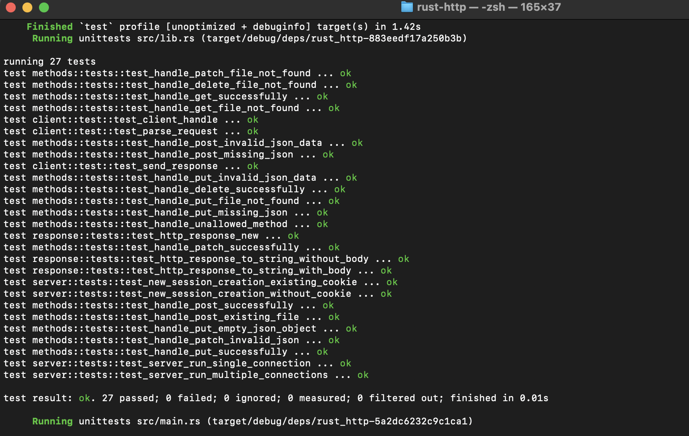
   <p>Figura 1: Resultado Unit Testing</p>
</div>

Todos los tests pasan de manera exitosa.

### Unit testing coverage
Se utilizó el paquete de `cargo-llvm-cov`, el cual se puede encontrar [aquí](https://lib.rs/crates/cargo-llvm-cov).
<div align="center">
   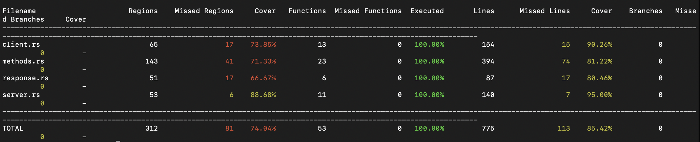
   <p>Figura 2: Resultados Unit Testing Coverage</p>
</div>

Según la herramienta, se logró un coverage de un 100% de las funciones, sin embargo, solamente se logró un 74.04% de coverage en las regiones y un 85.42% de coverages en las líneas.

Por lo tanto, concluimos que se obtuvo un coverage promedio de 86.48%.

### Integration testing single request
Para probar que el servidor funciona de manera exitosa se usó la aplicación de [APIDog](https://apidog.com/) para enviar los diferentes requests

#### GET
Endpoint: `get`

<div align="center">
   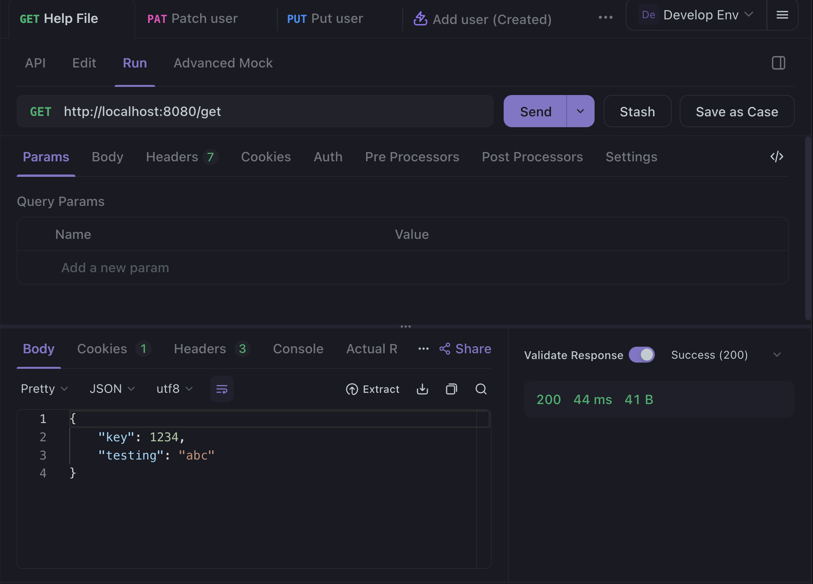
   <p>Figura 3: GET Request en APIDog</p>
</div>

<div align="center">
   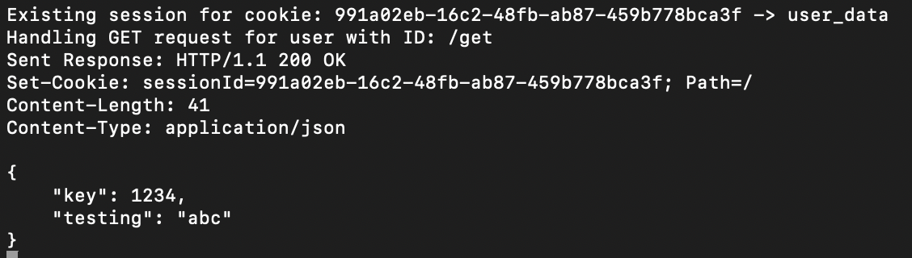
   <p>Figura 4: GET Request en servidor</p>
</div>

#### POST
Endpoint: `post`

<div align="center">
   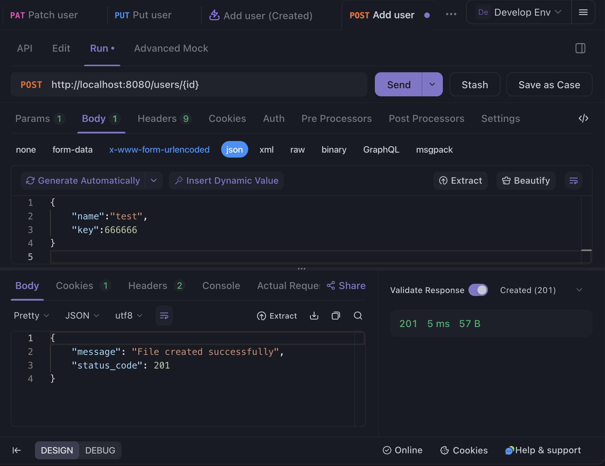
   <p>Figura 5: POST Request en APIDog</p>
</div>

<div align="center">
   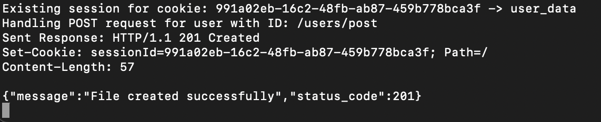
   <p>Figura 6: POST Request en servidor</p>
</div>

<div align="center">
   
   <p>Figura 7: Archivos POST Request</p>
</div>

#### DELETE
Endpoint: `post`

<div align="center">
   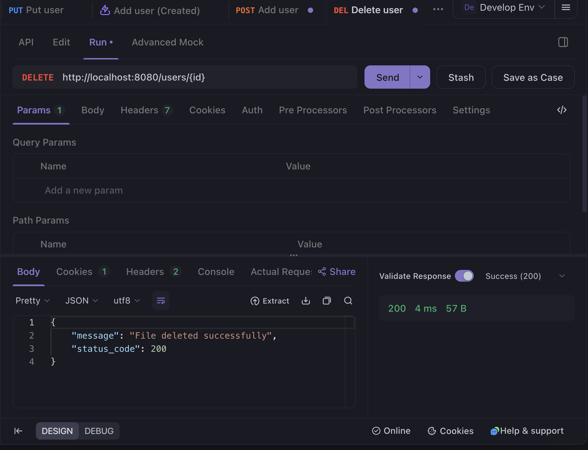
   <p>Figura 8: POST Request en APIDog</p>
</div>

<div align="center">
   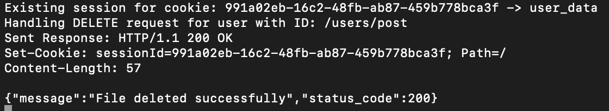
   <p>Figura 9: POST Request en servidor</p>
</div>

<div align="center">
   
   <p>Figura 10: Archivos POST Request</p>
</div>

#### PUT
Endpoint: `users/420`

<div align="center">
   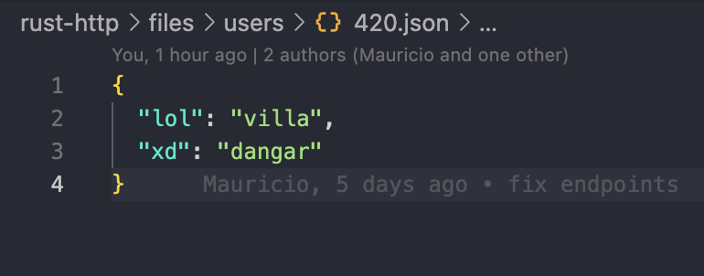
   <p>Figura 11: Archivos antes de PUT Request</p>
</div>

<div align="center">
   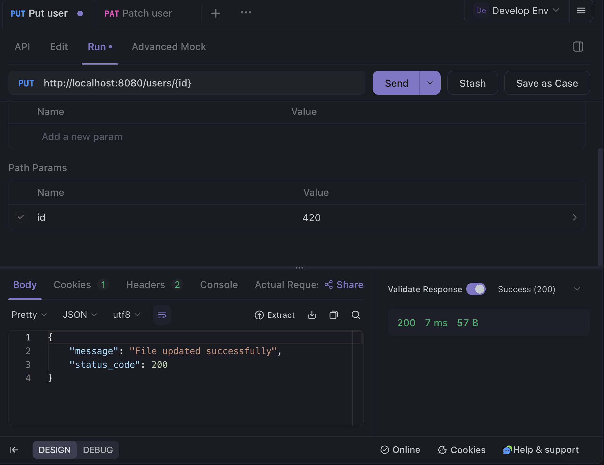
   <p>Figura 12: PUT Request en APIDog</p>
</div>

<div align="center">
   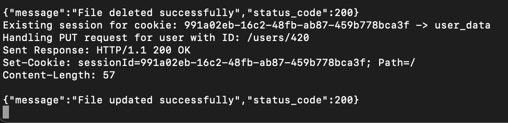
   <p>Figura 13: PUT Request en servidor</p>
</div>

<div align="center">
   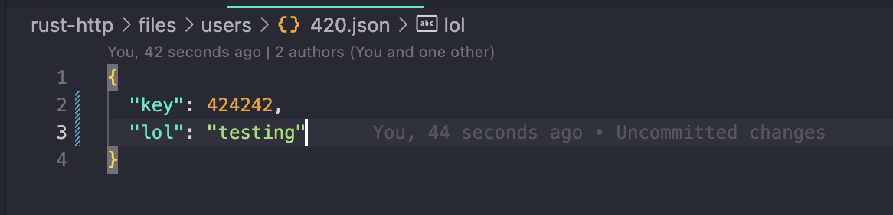
   <p>Figura 14: Archivos después de PUT Request</p>
</div>

#### PATCH
Endpoint: `users/420`

<div align="center">
   
   <p>Figura 11: Archivos antes de PATCH Request</p>
</div>

<div align="center">
   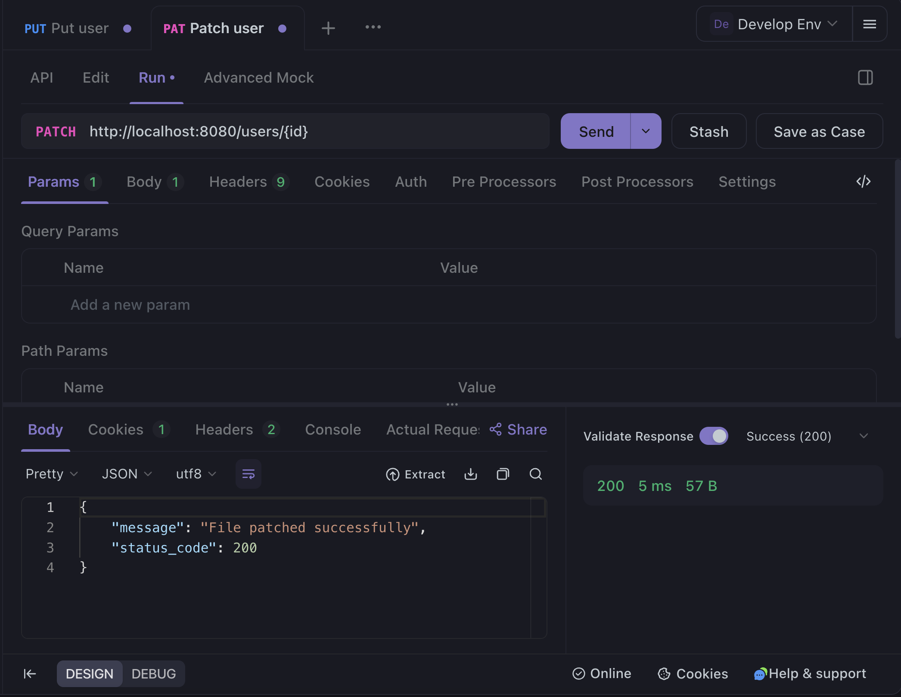
   <p>Figura 12: PATCH Request en APIDog</p>
</div>

<div align="center">
   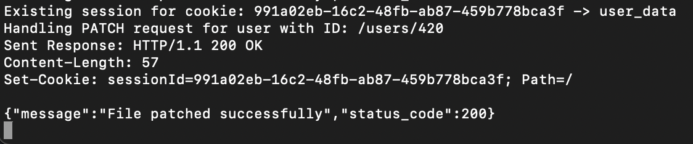
   <p>Figura 13: PATCH Request en servidor</p>
</div>

<div align="center">
   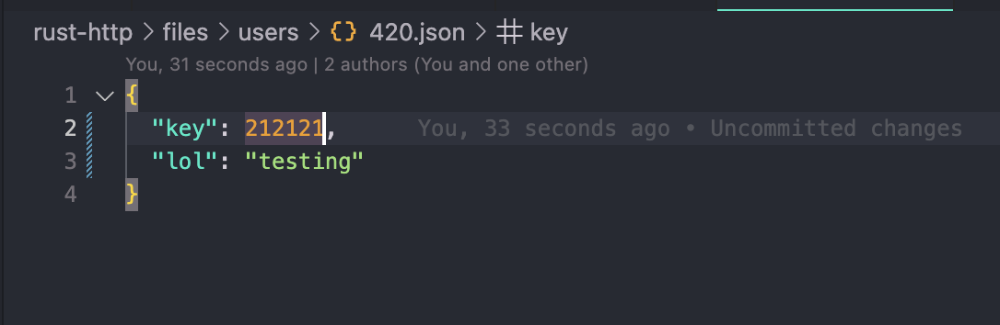
   <p>Figura 14: Archivos después de PATCH Request</p>
</div>
